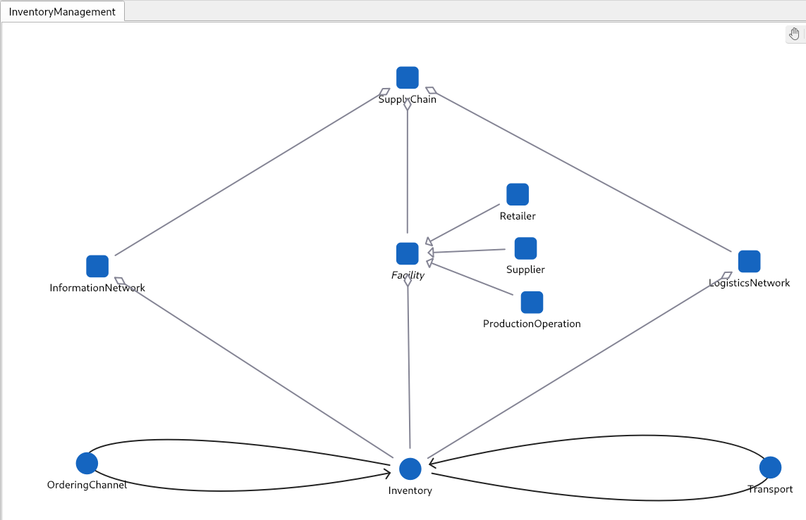
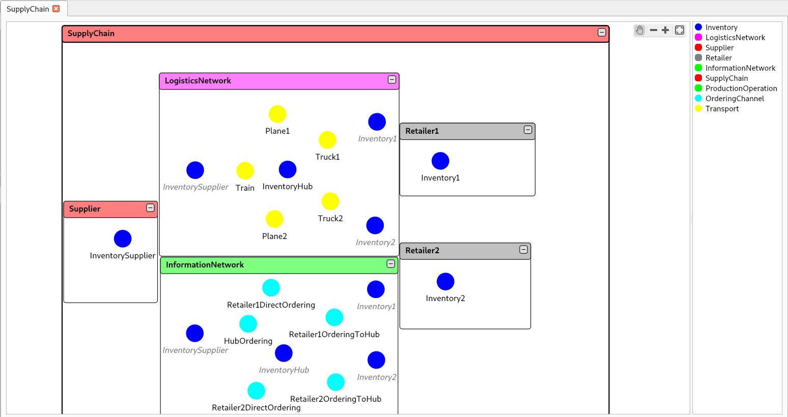
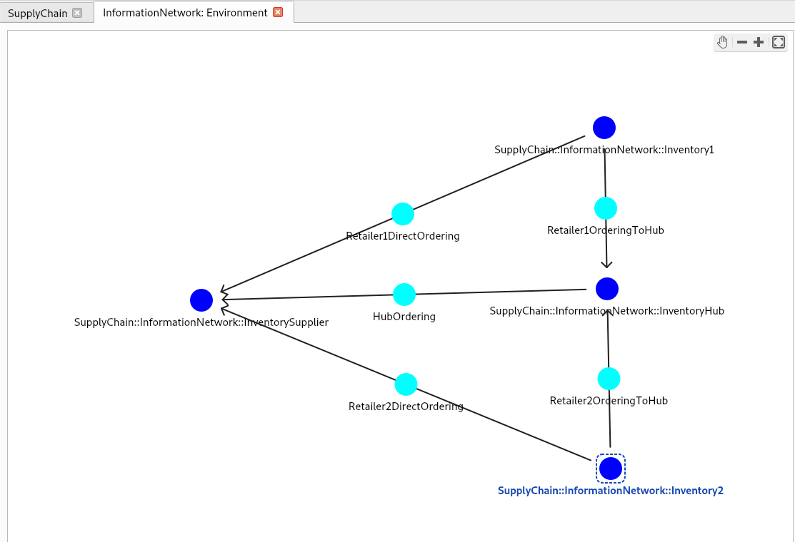
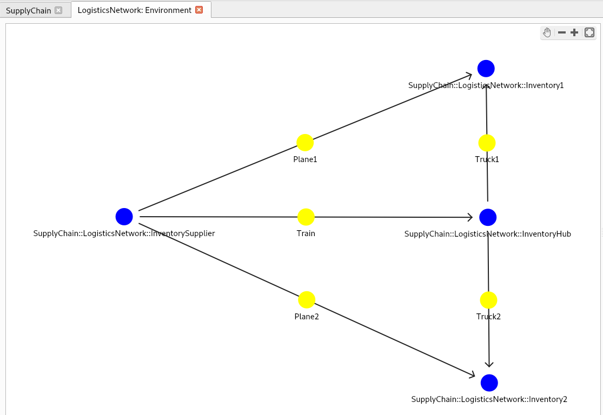

- [Inventory Management sample](#inventory-management-sample)
  - [Files available in this folder:](#files-available-in-this-folder)
  - [Use case](#use-case)
  - [Overview](#overview)
    - [The Simulator](#the-simulator)
    - [The Challenge](#the-challenge)
    - [Inventory Management conceptual model](#inventory-management-conceptual-model)
    - [Main entity types:](#main-entity-types)
      - [Hierarchical structure and control](#hierarchical-structure-and-control)
      - [Interaction networks, communication and transport](#interaction-networks-communication-and-transport)
    - [Instance model](#instance-model)
    - [Default simulator initial configuration](#default-simulator-initial-configuration)
    - [Processes scheduling and global Brain-Simulator behavior](#processes-scheduling-and-global-brain-simulator-behavior)
    - [Connection to Bonsai](#connection-to-bonsai)
      - [Available simulator states](#available-simulator-states)
        - [For training :](#for-training-)
        - [Additional simulator outputs used for monitoring, not used for training](#additional-simulator-outputs-used-for-monitoring-not-used-for-training)
      - [Brain actions](#brain-actions)
      - [Simulator configuration](#simulator-configuration)

# Inventory Management sample
Demo instance of the Cosmo Tech Inventory Management conceptual model

## Files available in this folder:
* README.me (this file): describes the Inventory Management demo simulator provided by the sample as well as the connector to Bonsai
* Cosmo_Tech_Inventory_Management_Demo_With_Bonsai.pdf: slides describing the sample project in more detail

## Use case
Inventory management of supply chain inventories under uncertain and volatile demand.

## Overview

This sample provides an example of AI control for the optimal management of inventories in a supply chain. It provides an instance of an Inventory Management Cosmo Tech simulator and an Inkling file to train a Bonsai brain. It illustrates that even in a seemingly simple supply chain with a few nodes, uncertainties, capacity constraints and competing interactions can make its behavior complex and its daily operation very hard.  It shows that the use of a Simulation Digital Twin to train an autonomous Brain agent with reinforcement learning for discovering adapted decision policies is able to cope with this complex dynamics and is therefore an appropriate solution to the management problem.

### The Simulator

The model represents a simple supply chain that consists of two retailers, a single supplier and a centralized storage hub, each of these facilities has a single inventory. The demand received by the retailers is uncertain, fluctuating and strong unpredictable peaks can occur. Inventories at each retailer must decide how much to order each week, what percentage of these orders must be sent directly to the supplier to be received quickly by plane, and what percentage can be ordered to the central hub and received by truck. The central hub send orders to the supplier, it must decide how much to order each week to be able to respond to the retailers' orders and build a safe stock. It can store large quantities and is located near the retailers so that shipments can be delivered quickly by truck but costs of storage must be taken into account. Shippments from the supplier to the hub are sent by train, the travel time is longer and uncertain. Plane shipping is much more expensive but it is received faster to avoid backlog penalties.

### The Challenge

Trade-offs between delivery speed and transport and storage costs, uncertainties in transport time, competition between retailers for available stocks, lags between decisions and the results of these decisions, coupling and interference between individual decisions, and an uncertain and volatile demand, strongly hinders the ability of a supply chain manager to make optimal decisions. The need to respect stock constraints and minimum service level requirements, makes the problem even harder.

An intelligent and adaptive global control policy is needed in order to build a resilient inventory management system able to fulfill the demand and maximize profit in such a complex and uncertain setting. It must decide how much each retailer must order directly to the supplier and how much to the hub, and how much the hub must order, at each time step, in order to be able to respond to the demand, reduce costs and maximize profit. In addition, it must respect eventual stocks constraints and minimum service level requirements, and all this under an uncertain and volatile demand.

### Inventory Management conceptual model

The model provided is a simple instance of a more generic conceptual model that can be used to simulate and optimize more complex supply chains. Other conceptual models of any type of organization and industry, and instances for different scenarios and use cases, can be built with the Cosmo Tech simulation platform (see https://cosmotech.com/platform/ for more information). The following is a short summary of this conceptual model, where only the most important elements, useful for a better understanding of the provided instance simulator and is interaction with the Bonsai brain, are mentioned.

### Main entity types: 
There are three main entity types : SupplyChain, Inventory and Facility. Facility is an abstract type and is thus not used explicitly in the sample instance model; instead, there are three concrete types of Facility, two of them used in the sample model (Retailer, Supplier), a third, ProductionOperation, is not used in this instance but is available for more complex models.

#### Hierarchical structure and control
A SupplyChain is composed of Facilities that contain Inventories, as well as Information and Logistics Networks that provide Inventories with communication and transport structures (see section below). Retailers entities are responsible for the reception and management of demands, the service of demands with existing on-hand quantities in its Inventories, and the computation of local demand and service indicators. Suppliers are responsible for the production of quantities according to their own current capacity and to incomming orders received at their inventories. Inventories themselves are responsible for the local management of orders, they collect quantities received from upstream inventories, prepare shipments to be sent to downstream inventories, and set the quantites to be ordered and their source allocations according to available predefined policies or to externally provided values (such as Bonsai's brain actions).   

#### Interaction networks, communication and transport
All communication and transport interactions occur at the inventory level, quantities are shipped and orders are sent from one inventory to another through the information and logistics networks, respectively. 
Orders are transmitted without delay through communication channels from one inventory to another. Shipments, on the other hand, can take some time to be delivered and this delay can be uncertain; Transport type entities are in charge of this process.

### Instance model

The following figure illustrates the hierarchical structure of the sample model. The detailed network topology of the Logistics and Transport networks are shown further below.

The information network has direct ordering channels from the Retailers' inventories to the supplier and indirect ordering channels through the Hub.

The transportation network topology is shown below. Quantities are sent from the supplier either by plane to the retailers or by train to the hub and then by truck.

### Default simulator initial configuration

The following parameter initial values are given for information about the simulator behavior. Note however that these variables are not all available for configuration from the inkling file (for those values, refer to 'Connection to Bonsai -> Simulator configuration' below).

* Supplier Capacity: infinite
* OnHandInventory:
  * Inventory1: 50 
  * Inventory2: 50
  * InventoryHub: 50
  * InventorySupplier: 300
* IncomePerPiece:
  * Retailer1: 100
  * Retailer2: 200 
* Transport TransportTime:
  * Truck1: 1
  * Truck2: 1
  * Plane1: 2
  * Plane2: 2
  * Train: U[5,7]  (uncertain, uniformly distributed)
* TransportCostPerPiece:
  * Truck1: 3
  * Truck2: 3
  * Plane1: 25
  * Plane2: 25
  * Train: 5

### Processes scheduling and global Brain-Simulator behavior
The global behavior of the simulator and the impact that a Bonsai's brain actions have on it during training depend both on the ordering of processes execution within the model and on the place of Bonsai's brain actions within that ordering. The following sequence summarizes this processes scheduling:

* For each Retailer: set demand on own inventory
* Repeat N times:
  * Bonsai brain: reads state
  * Bonsai brain: send actions (set quantities to order and source allocations on Retailer1, Retailer2 and Hub Inventories)
  * For each inventory (1,2,Hub) : set quantities to order and source allocation to those set by the brain, send orders to upstream inventories
  * Supplier: produce quantities
  * Supplier inventory: collect production and prepare shipments
     * For each Transport from supplier (Plane1, Plane2,Train): collect shipments, advance shipments being transported, prepare and deliver shipments
  * Hub inventory: collect input quantities and prepare shipments
  * For each Transport from Hub (Truck1, Truck2):  collect shipments, advance shipments being transported, prepare and deliver shipments arriving at destination
  * For each Retailer:
    * Own inventory: collect received quantities and prepare them for Retailer
    * Serve demand
  * Update persistent state variables: HoldingCost (Inventories), Supplier Capacity,
  * Clear temporal state variables: 
  * Increment time
  * For each Retailer: 
    * Update CurrentDemand and CurrentDemandWithBacklog
    * Set Inventory::Demand with CurrentDemand
  
Note that most of the values of states available for teaching or monitoring in Bonsai are those at the end of each Repeat block, whereas the CurrentDemand value is the new value for the new simulation step loaded at the end of the Repeat block.  That is, the value of the CurrentDemand (and CurrentDemandWithBacklog) is in advance of all other states values by one simulation step. Therefore, values for other states such as the FulfilledDemand correspond to the previous step CurrentDemand.

### Connection to Bonsai

#### Available simulator states
The following state variables are made available to Bonsai at each simulation step through the connector interface.
From these variables, the IncrementProfit, CurrentServiceLevel, OnHandInventory(\_1,\_2,\_Hub) and AlreadyOrderedQuantity(\_1,\_2,\_Hub) have been made available for training in the inkling file, all other variables are made available for visualization of the simulator state during training or assessment.

Note that it is possible to change the inkling file to use other set of variables for training if you want to test an alternative training.

##### For training :
On hand quantity and already ordered quantities for each Inventory.
* IncrementProfit (float): Increment of aggregated profit over both retailers at each simulation step (float)
* CurrentServiceLevel (float in [0,1]) : Average of ImmediatelyFulfilledDemand(at current step)/CurrentDemand(at previous step) for both retailers 
* OnHandInventory_1, OnHandInventory_2, OnHandInventory_Hub: current stock at each (non-supplier) inventory (all float)
* AlreadyOrderedQuantity_1, AlreadyOrderedQuantity_2, AlreadyOrderedQuantity_Hub : cummulated quantity already ordered by each (non-supplier) inventory (all float)
* CurrentDemand_1, CurrentDemand_2: Demand for each retailer at the current time step (both float)

##### Additional simulator outputs used for monitoring, not used for training
* BacklogQuantity_1, BacklogQuantity_2: cummulated unserved demand for each retailer (both float)
* QuantityOrderedByPlane_1,QuantityOrderedByPlane_2, QuantityOrderedThroughHub_1, QuantityOrderedThroughHub_2: (all float),
* QuantityAtDestination_Truck1, QuantityAtDestination_Truck2, QuantityAtDestination_Plane1, QuantityAtDestination_Plane2, QuantityAtDestination_Train: (all float)
* FulfilledDemand_1, FulfilledDemand_2: cummulated demand that has been served (either immediatly or not, up to the previous step) by each Retailer (both float)
* ImmediatlyFulfilledDemand_1, ImmediatlyFulfilledDemand_2: demand that has been served immediatly (at the previous step) by each Retailer (both float)

#### Brain actions
The bonsai brain actions override and control the inventories' decision policies through the simulation controler. There are two different decisions produced by the brain for each inventory: the quantity to be ordered and the allocation of that order to upstream inventories. These actions are, for the sample instance:
* Order_Inventory1, Order_Inventory2 and Order_InventoryHub (Quantities ordered by each retailer and by the hub, positive real numbers)
* Inventory1_AllocateToHub and Inventory2_AllocateToHub (proportion ordered by each Retailer that is allocated to the Hub, real number between 0 and 1, the complement is ordered directly to the supplier)

#### Simulator configuration
The following simulator parameters are available for configuration from the inkling file. Note that you can change the inkling file to set different values for this parameters if you want to test alternative trainings.  
    
* HoldingCostPerPiece_Inventory1, HoldingCostPerPiece_Inventory2, HoldingCostPerPiece_InventoryHub: holding costs per piece for Retailer 1, Retailer 2 and Hub inventories(all float; default values are: 2, 2 and 3 respectively)
* TransportCostPerPiece_Plane1, TransportCostPerPiece_Plane2, TransportCostPerPiece_Truck1, TransportCostPerPiece_Truck2, TransportCostPerPiece_Train: transport costs per piece for each Transport entity (all float; default values are 25,25,3,3 and 5, respectively)

